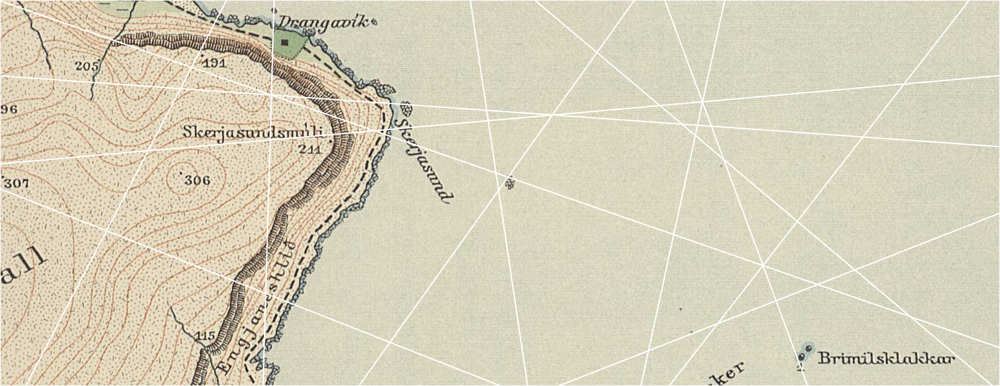
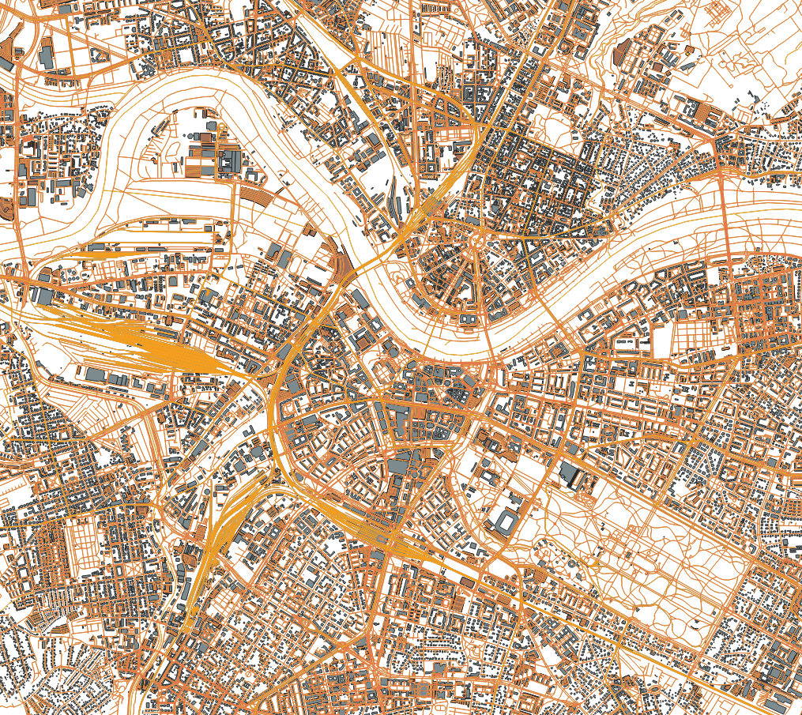
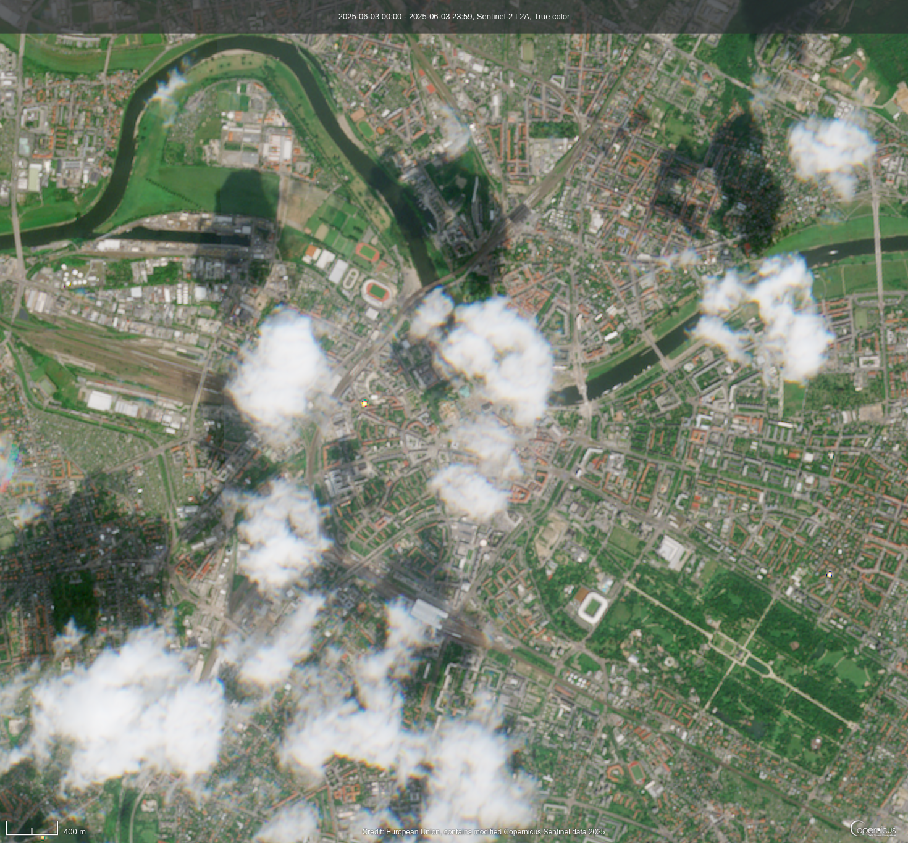
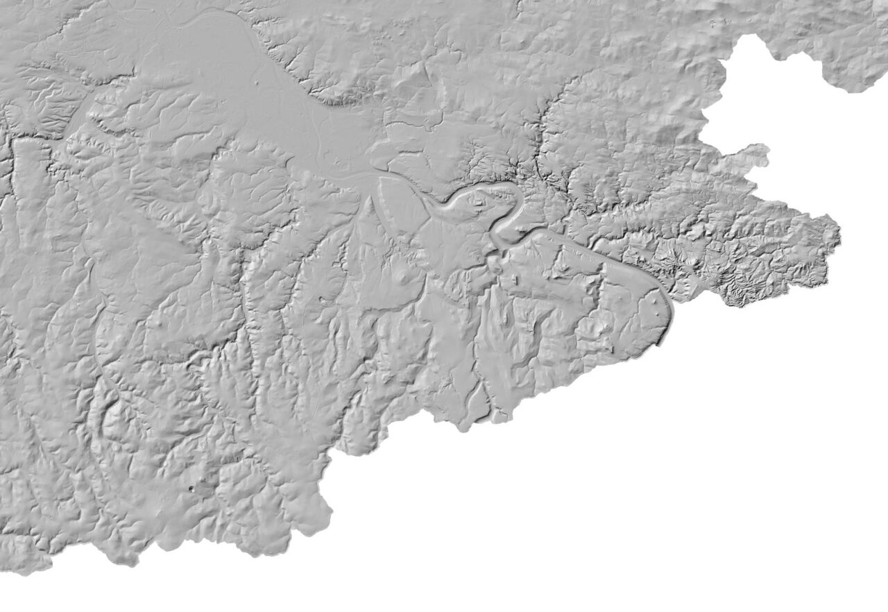
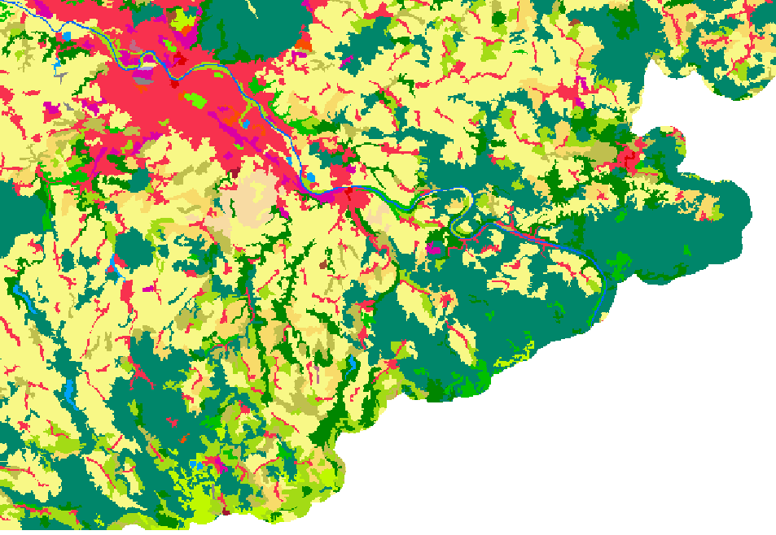

<!--
author: Arne Rümmler
language: de
mode:     Presentation
logo:   ./assets/slub.png
link: ./css/rue.css

@color: <span style="color: @0">@1</span>
@fontsize: <span style="font-size: @0px">@1</span>
-->


# Einführungskurs Geodaten

**@fontsize(24,@author)**, *@fontsize(24, SLUB Dresden)*

<div style="margin-top: 100px">
</div>



<div class="bg-slide">

</div>


# Was sind Geodaten?

<figure style="float: right; width: 45%; margin-left: 40px; margin-bottom: 10px; text-align: center;">
  
  <figcaption style="font-size: 90%; font-style: italic;">Abbildung: flaticon, CC BY-SA 4.0, via Wikimedia Commons
</figcaption>
</figure>

**Geodaten sind alle Daten die Information zu ihrer Position auf(/in) der Erde beinhalten.**

- Foto mit Ihrem Handy → Koordinaten in Metadaten gespeichert
- Regenradar
- Paketzustellung (geschätzte Ankunftszeit, Karte)
- Evakuierung bei Bombenfund
- Aber auch weniger naheliegendes, z.B.: Renaissance: 
“... the Renaissance was first centered in the Republic of Florence, then spread to the rest of Italy and later throughout Europe.”


## Datenstrukturen: Raster und Vektor


- Die zwei Haupttypen geografischer Daten sind **Raster**- und **Vektordaten**.

- Rasterdaten werden als Gitter aus Werten gespeichert, die als Pixel auf einer Karte dargestellt werden. Jeder Pixelwert repräsentiert ein Gebiet auf der Erdoberfläche.

- Vektordaten beschreiben spezifische Objekte auf der Erdoberfläche (Punkte, Linien, Polygone) und weisen diesen Attribute zu. 

<div style="display: flex; align-items: flex-start; gap: 10px;">

  <div style="flex: 1;">
    <figure style="text-align: center;">
      
      <figcaption style="font-style: italic;">
        Abbildung: OpenStreetMap-Vektordaten (Data/Maps Copyright 2018 Geofabrik GmbH and OpenStreetMap Contributors)
      </figcaption>
    </figure>
  </div>

  <div style="flex: 1;">
    <figure style="text-align: center;">
      
      <figcaption style="font-style: italic;">
        Abbildung: Sentinel-2-Rasterdaten (Copernikus Browser, https://browser.dataspace.copernicus.eu)
      </figcaption>
    </figure>
  </div>

</div>


# Was sind Rasterdaten?
<div style="display: flex; align-items: start; gap: 40px;">

  <div style="flex: 2;margin-top:30px;">
Rasterdaten sind gepixelte (gerasterte) Daten, wobei jedem Pixel eine geografische Lage zugeordnet ist. Der Wert eines Pixels kann:

* kontinuierlich sein (z. B. Höhe), oder
* kategorial sein (z. B. Landnutzung).

Ein georeferenziertes Raster enthält neben den Bilddaten auch Informationen zu:

* Ausdehnung (Extent)
* Zellgröße (Auflösung)
* Anzahl der Zeilen und Spalten
* Koordinatenreferenzsystem (CRS)
</div>
<div style="flex: 2.5; text-align: right;">
<figure style="margin: 0;">
  
  <figcaption style="font-style: italic; font-size: 90%; text-align: right;">
    Abbildung: Konzept einer Rasterdatenstruktur (National Ecological Observatory Network, NEON) 
  </figcaption>
</figure>
</div>

</div>

## Beispiele Rasterdaten

<div style="display: flex; align-items: start; gap: 40px;">

<div style="flex: 1;">
Beispiele für kontinuierliche Rasterdaten:

1. Regenradar
2. Historische Karten
3. Höhenmodelle (DGM - Digitale Geländemodelle)



*Abbildung: Digitales Geländemodell Südostsachsens (Quelle: GeoSN, dl-de/by-2-0 / https://mathias-groebe.de/opendata-dgm20-sachsen/)*
</div>

<div style="flex: 1;">

Beispiele für kategoriale Rasterdaten:

1. Landnutzungskarten
2. Schadenskartierung (leicht, mittel, schwer)
3. Höhenklassenkarten



*Abbildung: Corine Landcover Germany in Südostsachsen (Quelle: Deutsches Luft- und Raumfahrtzentrum , DLR)*
</div>
</div>


## Wichtige Eigenschaften von Rasterdaten
<div style="display: flex; align-items: start; gap: 40px;">

<div style="flex: 2;">
**Ausdehnung (Extent)**

Die Ausdehnung gibt das geografische Gebiet an, das durch das Raster abgedeckt wird (Nord-, Süd-, Ost- und Westgrenze).


*Abbildung: Darstellung der räumlichen Ausdehnung eines Rasters (Quelle: National Ecological Observatory Network, NEON)*
</div>
<div style="flex: 3;">
**Auflösung (Resolution)**

Die Auflösung beschreibt die Fläche am Boden, die ein einzelner Pixel abdeckt. Höhere Auflösung = kleinere Zellen = mehr Details.


*Abbildung: Auswirkungen unterschiedlicher Auflösung auf Rasterdarstellung (Quelle: National Ecological Observatory Network, NEON)*
</div>
</div>


## Rasterdatenformate

Rasterdatenformate für Geodaten sind i.d.R. die selben Formate, die auch für digitale Bilder verwendted werden (JPEG, TIF, JPEG2000), aber ergänzt um den räumlichen Bezug. 

- Der Quasi-Standard für Rasterdaten ist das **GeoTIFF-Format** `.tif`. 
- Seltener, aber insbesondere bei Verwaltungsdaten ist das **XYZ-Format** `xyz`/`txt` anzutreffen. 
- Auch weniger häufig ist GMLJKP2 `gmljp2` (Geographic Markup Language + JPEG2000). 


# Was sind Vektordaten?

<div style="display: flex; align-items: start; gap: 40px;">
<div style="flex: 8;margin-top:30px;">

Vektordaten stellen konkrete Objekte auf der Erdoberfläche dar und verknüpfen diese mit Attributen. Die Geometrie wird durch sogenannte Scheitelpunkte (x-, y-Koordinaten) definiert. Die Anordnung dieser Punkte bestimmt den Geometrietyp:

* **Punkte:** Ein einzelnes x,y-Koordinatenpaar (z. B. Messstationen, Bäume, Probeflächen).
* **Linien:** Verbundene Punkte (z. B. Straßen, Flüsse), wobei jeder Knick einen Scheitelpunkt darstellt.
* **Polygone:** Geschlossene Linien mit mindestens drei Punkten (z. B. Seen, Flächen, Ländergrenzen).

Ein Vektorgeodatenobjekt, also der Zusammenschluss von Geometrie und Attributen, wird als **Feature** bezeichnet. 

</div>
<div style="flex: 6;">


*Abbildung: Punkte, Linien und Polygone (Quelle: National Ecological Observatory Network, NEON)*
</div>
</div>


## Besonderheiten Vektordaten

<div style="display: flex; align-items: start; gap: 20px;">
<div style="flex: 1;">

* Mehrere Attribute pro Objekt möglich (z. B. Einrichtung, Träger, Bemerkung, Größe, Adresse, ...)
* Geometrientypen (Punkt, Linie, Polygon) transportieren zusätzliche Bedeutung 
  
  * Modelliere ich eine Wanderung als Linie oder als Abfolge von Punkten (jeder Punkt kann dann eigene Attribute haben!) dar?
* Komplexes Datenmodell mit vielen Datenformaten
  
  * konsistente Datenhaltung schwierig
  * kaum Standards, einige Best Practices
  * viele Speziallösungen
</div>
<div style="flex: 2;">

<iframe width="100%" height="600px" src="./assets/map.html"></iframe>
**Beispiel: [legale Graffitiflächen in Dresden](https://opendata.dresden.de/informationsportal/?open=1&result=3B7136B1ADF14E59A2E74D3FACE95C2C#app/mainpage)** (Quelle: https://opendata.dresden.de/)
</div>
</div>


## Vektordatenformate

<div style="display: flex; align-items: start; gap: 20px;">
<div style="flex: 1;">
**Shapefile `.shp`**

- Klassisches ESRI-Format (proprietär)
- Besteht aus: `.shp` (Geometrie), `.shx` (Index), `.dbf` (Attribute)
- Weit verbreitet, aber veraltet
- Zeichenbeschränkung für Attribute
</div>
<div style="flex: 1;">
**GeoJSON `geojson`/`json`**

- JSON-basiert
- Ideal für Webkarten (z. B. Leaflet, Mapbox)
- Unterstützt Punkte, Linien, Polygone und Sammlungen
- nicht standardisiert
</div>
<div style="flex: 1;">
**GeoPackage `gpkg`**

- SQLite-basiert (eine Mini-Datenbank)
- Raster- & Vektordaten gemeinsam speicherbar
- Offener Standard (OGC)
- Gut für GIS Anwendungen geeignet (z.B. Datenanalyse oder Kartenerstellung)
</div>
<div style="flex: 1;">
**KML `.kml`/`.kmz`**

- Für Google Earth, Earth Engine
- XML-basiert
- unterstützt Styles -> Vermischung von Daten und Datenvisualisierung
- Gut in Google Ökosystem; nicht so gut außerhalb
</div>
</div>

<div style="margin-top:20px;">
</div>

<!--
data-marker="
1 0 1 135 rgba(255,0,0,0.6); 
"
-->
```ascii
+-----------+------------------+------------------+---------+------------------+---------------------------------------+
| Format    | Offener Standard | Web-Tauglichkeit | Kompakt | GIS-Tauglichkeit | Lesbar & verständlich für Menschen    |
+-----------+------------------+------------------+---------+------------------+---------------------------------------+
| Shapefile |       ✘          |        ✘         |    ✘    |        ✔         | ✘ Binärformat                         |
| GeoJSON   |       ∼          |        ✔         |    ✔    |        ∼         | ✔ Klarer Text, simple Struktur        |
| GPKG      |       ✔          |        ✘         |    ✔    |        ✔         | ✘ Binärformat                         |
| KML/KMZ   |       ✔          |        ✔         |    ✔    |        ∼         | ∼ XML-basiert, oft tief verschachtelt |
+...........+..................+..................+.........+..................+.......................................+
| Tabellen  |       ✘          |        ✘         |    ✔    |        ✘         | ✔ Sehr gut                            |
+-----------+------------------+------------------+---------+------------------+---------------------------------------+
```


**Tabellen `csv`/`xlxs`/...**

- kein eigentliches Geodatenformat, wird aber häufig verwendet
- nur für Punktdaten mit flachen Attributen geeignet
- sehr einfach zu verwenden


# Zusammenfassung

**Rasterdaten**

* Rasterdaten bestehen aus Pixeln, die mit geografischen Koordinaten verknüpft sind.
* Rasterdaten besitzen immer eine Ausdehnung und eine Auflösung.
* Die Ausdehnung gibt das geografische Gebiet an, das vom Raster abgedeckt wird.
* Die Auflösung beschreibt, wie groß jeder Pixel auf dem Boden ist.
* Das Quasi-Standardformat für Rasterdaten ist **GeoTIFF**.

**Vektordaten**

* Vektordaten repräsentieren einzelne Objekte mit eindeutiger Geometrie und Attributen.
* Ein Vektordatenobjekt wird als Feature bezeichnet.
* Es gibt drei Geometrietypen: Punkt, Linie und Polygon.
* Für Geodaten-AnfängerInnen empfiehlt sich die Arbeit mit Tabellen oder **GeoJSON**.
* GIS-Software arbeitet typischerweise mit flachen Attributen (keine Verschachtelung)

# Historische Orte geocodieren

- Umfrage: https://forms.cloud.microsoft/pages/responsepage.aspx?id=apeF6xEBKkC_w59XifO4X0LFZlpATcxOiuPLhi2VPyxUOFJDNThKNVo0S0k3R0k3TVVXSkhDMjRWMyQlQCN0PWcu&route=shorturl

- https://www.digitale-sammlungen.de/de/view/bsb10469652?page=1