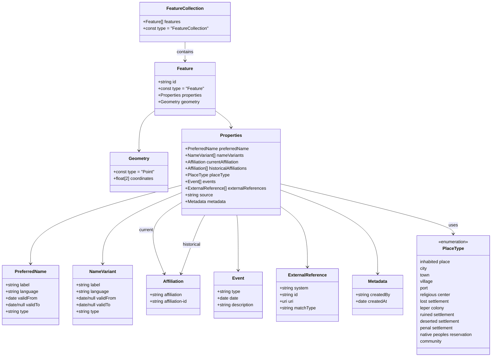

```mermaid
classDiagram
    class FeatureCollection {
        +Feature[] features
        +const type = "FeatureCollection"
    }

    class Feature {
        +string id
        +const type = "Feature"
        +Properties properties
        +Geometry geometry
    }

    class Geometry {
        +const type = "Point"
        +float[2] coordinates
    }

    class Properties {
        +PreferredName preferredName
        +NameVariant[] nameVariants
        +Affiliation currentAffiliation
        +Affiliation[] historicalAffiliations
        +PlaceType placeType
        +Event[] events
        +ExternalReference[] externalReferences
        +string source
        +Metadata metadata
    }

    class PreferredName {
        +string label
        +string language
        +date validFrom
        +date/null validTo
        +string type
    }

    class NameVariant {
        +string label
        +string language
        +date/null validFrom
        +date/null validTo
        +string type
    }

    class Affiliation {
        +string affiliation
        +string affiliation-id
    }

    class Event {
        +string type
        +date date
        +string description
    }

    class ExternalReference {
        +string system
        +string id
        +uri uri
        +string matchType
    }

    class Metadata {
        +string createdBy
        +date createdAt
    }

    class PlaceType {
        <<enumeration>>
        inhabited place
        city
        town
        village
        port
        religious center
        lost settlement
        leper colony
        ruined settlement
        deserted settlement
        penal settlement
        native peoples reservation
        community
    }

    FeatureCollection --> Feature : contains
    Feature --> Properties
    Feature --> Geometry
    Properties --> PreferredName
    Properties --> NameVariant
    Properties --> Affiliation : current
    Properties --> Affiliation : historical
    Properties --> Event
    Properties --> ExternalReference
    Properties --> Metadata
    Properties --> PlaceType : uses

```